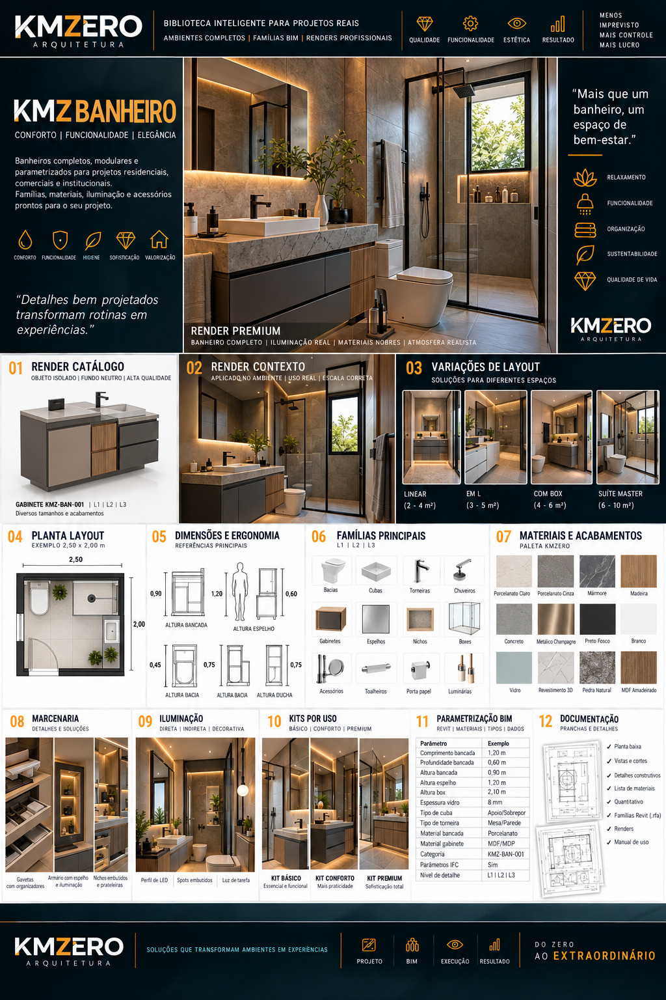

# KMZ BANHEIRO

Documento: KMZ-ARQ-BIM-001 · Módulo 07 · Ambiente `BAN` · **Rev.00** · `EM DESENVOLVIMENTO`

**Posicionamento:** *Conforto | Funcionalidade | Elegância*
**Frase-conceito:** *"Mais que um banheiro, um espaço de bem-estar."*
**Atributos:** Relaxamento · Funcionalidade · Organização · Sustentabilidade · Qualidade de vida

---

## Referência visual

> **REFERÊNCIA VISUAL APROVADA — CONCEITO**
>
> A linguagem gráfica, composição e direção estética são referências KMZERO.
> Textos, números, CNPJ, registros, dimensões ou outros dados ilustrativos
> eventualmente gerados na imagem **não constituem dados técnicos aprovados**.

### ⚠️ Achado que confirma a regra acima

O bloco de ergonomia da referência apresenta **duas cotas diferentes sob o mesmo rótulo
"ALTURA BACIA"** (0,45 e 0,75) e uma cota de **"ALTURA DUCHA" em 0,75 m** — altura
incompatível com uma ducha de uso real. Ou seja: a própria imagem se contradiz.

Isso não é defeito da referência — ela é referência **estética**, e nessa função está
correta. É a demonstração prática de por que nenhuma cota daqui pode subir para
`APROVADO` sem validação. Todas as dimensões abaixo estão `A VALIDAR` por esse motivo.

---

## 01 · Famílias — `EM DESENVOLVIMENTO`

| Família | Categoria Revit proposta | Código previsto | Status |
|---|---|---|---|
| Gabinete | Mobiliário | `KMZ-BAN-001` | Transcrito da referência |
| Cuba | Aparelho sanitário | `KMZ-BAN-002` | A definir |
| Bacia sanitária | Aparelho sanitário | `KMZ-BAN-003` | A definir |
| Torneira | Aparelho sanitário | `KMZ-BAN-004` | A definir |
| Chuveiro / ducha | Aparelho sanitário | `KMZ-BAN-005` | A definir |
| Espelho | Mobiliário | `KMZ-BAN-006` | A definir |
| Nicho | Mobiliário / Modelo genérico | `KMZ-BAN-007` | A definir |
| Box | Modelo genérico ou Janela | `KMZ-BAN-008` | **Decisão pendente** |
| Acessórios (toalheiro, porta-papel) | Aparelho sanitário | `KMZ-BAN-009+` | A definir |
| Luminária | Luminária | `KMZ-GER-***` | Transversal |

**Decisão pendente relevante:** o **box** é a peça mais ambígua do ambiente. Como
Modelo genérico é simples de modelar mas não hospeda em parede nem gera vão; como
Janela (ou Porta) hospeda corretamente e gera abertura, ao custo de aparecer em
tabelas de esquadria. A escolha afeta quantitativo e documentação. `A VALIDAR`.

## 02 · Níveis L1 / L2 / L3 — `EM DESENVOLVIMENTO`

Referência declara `L1 | L2 | L3` para o gabinete. Critérios gerais em
[`../05-biblioteca-L1-L2-L3.md`](../05-biblioteca-L1-L2-L3.md). Definição peça a peça: pendente.

## 03 · Dimensões — `A VALIDAR` (todas)

| Parâmetro | Valor na referência | Procedência | Status |
|---|---|---|---|
| Comprimento da bancada | 1,20 m | Transcrito da referência visual | `A VALIDAR` |
| Profundidade da bancada | 0,60 m | Transcrito da referência visual | `A VALIDAR` |
| Altura da bancada | 0,90 m | Transcrito da referência visual | `A VALIDAR` |
| Altura do espelho | 1,20 m | Transcrito da referência visual | `A VALIDAR` |
| Altura do box | 2,10 m | Transcrito da referência visual | `A VALIDAR` |
| Espessura do vidro do box | 8 mm | Transcrito da referência visual | `A VALIDAR` |
| Altura da bacia | 0,45 **e** 0,75 m | **Contraditório na referência** | ⛔ `CONFLITO` |
| Altura da ducha | 0,75 m | **Implausível** — ver achado acima | ⛔ `CONFLITO` |

**Nenhum destes valores pode ir para projeto executivo nesta revisão.**

## 04 · Posicionamento — `EM DESENVOLVIMENTO`

| Item | Regra proposta | Status |
|---|---|---|
| Gabinete | Hospedado em parede, cota de face superior como referência | `A VALIDAR` |
| Cuba | Hospedada no gabinete (família aninhada) ou independente | **Decisão pendente** |
| Bacia | Hospedada em piso; distância mínima lateral a validar | `A VALIDAR` |
| Espelho | Hospedado em parede, cota de base | `A VALIDAR` |
| Box | Ver decisão de categoria em §01 | Pendente |

**Decisão pendente:** cuba aninhada no gabinete facilita a montagem e mantém o conjunto
coerente, mas trava a combinação (cada combinação vira um tipo). Cuba independente dá
liberdade e complica o posicionamento. Recomendo **aninhada com parâmetro de tipo
intercambiável** (*nested shared family*) — dá as duas coisas, ao custo de uma família
mais complexa. `A VALIDAR`.

## 05 · Ergonomia — `EM DESENVOLVIMENTO`

Os valores da referência estão listados em §03 e são inservíveis como estão.
**Fonte necessária:** dimensões de uso de banheiro devem vir de norma de acessibilidade
e de antropometria, não de imagem. **Não tenho o texto dessas normas disponível aqui e
não vou citar valores de memória.** Esta etapa fica bloqueada até que a fonte primária
seja consultada.

## 06 · Materiais — `EM DESENVOLVIMENTO`

Paleta da referência (12 amostras), mapeada para a nomenclatura de
[`../08-nomenclatura-bim.md`](../08-nomenclatura-bim.md):

| Amostra | Material KMZERO proposto |
|---|---|
| Porcelanato Claro | `KMZ_PORC_Claro_Acetinado` |
| Porcelanato Cinza | `KMZ_PORC_Cinza_Acetinado` |
| Mármore | `KMZ_PED_Marmore_Polido` |
| Madeira | `KMZ_MAD_Natural_Acetinado` |
| Concreto | `KMZ_CONC_Aparente_Natural` |
| Metálico Champagne | `KMZ_MET_Champagne_Escovado` |
| Preto Fosco | `KMZ_PINT_Preto_Fosco` |
| Branco | `KMZ_PINT_Branco_Fosco` |
| Vidro | `KMZ_VID_Incolor_Temperado` |
| Revestimento 3D | `KMZ_REV_3D_Branco` |
| Pedra Natural | `KMZ_PED_Natural_Bruto` |
| MDF Amadeirado | `KMZ_MAD_MDF-Amadeirado_Fosco` |

Nomes específicos (tom exato, fabricante, código) `A VALIDAR`.

## 07 · Marcenaria — `EM DESENVOLVIMENTO`

Soluções da referência: gavetas com organizadores · armário com espelho e iluminação
integrada · nichos embutidos e prateleiras.

Detalhamento pendente: ferragem, sistema de corrediça, espessura de painel, folga de
montagem, tratamento de topo.

## 08 · Iluminação — `EM DESENVOLVIMENTO`

Tipos da referência: perfil de LED · spots embutidos · luz de tarefa (espelho).
Temperatura de cor, fluxo e fotometria: pendentes. Ver decisão sobre IES em
[`../05-biblioteca-L1-L2-L3.md`](../05-biblioteca-L1-L2-L3.md) §5.4.

## 09 · Decoração — `EM DESENVOLVIMENTO`

Objetos de cena (plantas, toalhas, frascos) vão em **categoria de decoração**, com
`KMZ_Quantificar = Não`. Decoração nunca entra no quantitativo de projeto.

## 10 · Kits — `EM DESENVOLVIMENTO`

| Kit | Composição |
|---|---|
| **BÁSICO** | Essencial e funcional — a definir peça a peça |
| **CONFORTO** | Mais praticidade — a definir |
| **PREMIUM** | Sofisticação total — a definir |

## 11 · BIM / Revit — `EM DESENVOLVIMENTO`

Parâmetros da referência e onde cada um cai no arquivo de parâmetros compartilhados
(ver [`../09-parametros/`](../09-parametros/)):

| Parâmetro na referência | Parâmetro KMZERO |
|---|---|
| Comprimento bancada | `KMZ_Largura_Modulo` |
| Profundidade bancada | `KMZ_Profundidade_Modulo` |
| Altura bancada | `KMZ_Altura_Modulo` |
| Altura espelho / box | `KMZ_Altura_Instalacao` |
| Espessura vidro | `KMZ_Espessura_Painel` |
| Tipo de cuba / torneira | `KMZ_Acabamento` ou tipo dedicado — `A VALIDAR` |
| Material bancada / gabinete | `KMZ_Material_Principal` / `KMZ_Material_Secundario` |
| Categoria (`KMZ-BAN-001`) | `KMZ_Codigo` |
| Nível de detalhe | `KMZ_Familia_Nivel` |
| Parâmetros IFC | Mapeamento IFC — **`A VALIDAR`**, ver abaixo |

**Sobre "Parâmetros IFC: Sim":** a referência afirma isso, mas exportação IFC exige
mapeamento explícito de categoria e de propriedade (*property set*). Isso **não existe
ainda** e não acontece automaticamente. Marcar como pendência real, não como recurso
pronto.

## 12 · Documentação — `EM DESENVOLVIMENTO`

Conforme a referência: planta baixa · vistas e cortes · detalhes construtivos ·
lista de materiais · quantitativo · famílias Revit (`.rfa`) · renders · manual de uso.

## 13 · Renderização — `EM DESENVOLVIMENTO`

Três níveis (CATÁLOGO · CONTEXTO · PREMIUM) conforme
[`_MATRIZ-OFICIAL.md`](./_MATRIZ-OFICIAL.md). Variações de layout declaradas na
referência — **áreas `A VALIDAR`**:

| Layout | Área declarada na referência |
|---|---|
| Linear | 2 – 4 m² |
| Em L | 3 – 5 m² |
| Com box | 4 – 6 m² |
| Suíte master | 6 – 10 m² |

---

## Pendências deste ambiente

| # | Pendência | Bloqueia |
|---|---|---|
| BAN-01 | Resolver o conflito de altura da bacia e da ducha | Etapas 03 e 05 |
| BAN-02 | Consultar norma de acessibilidade/antropometria (fonte primária) | Etapa 05 |
| BAN-03 | Decidir a categoria Revit do box | Etapas 01, 04, 12 |
| BAN-04 | Decidir cuba aninhada × independente | Etapas 01, 04 |
| BAN-05 | Validar todas as cotas de §03 | Uso executivo |
| BAN-06 | Definir o mapeamento IFC real | Etapa 11 |
