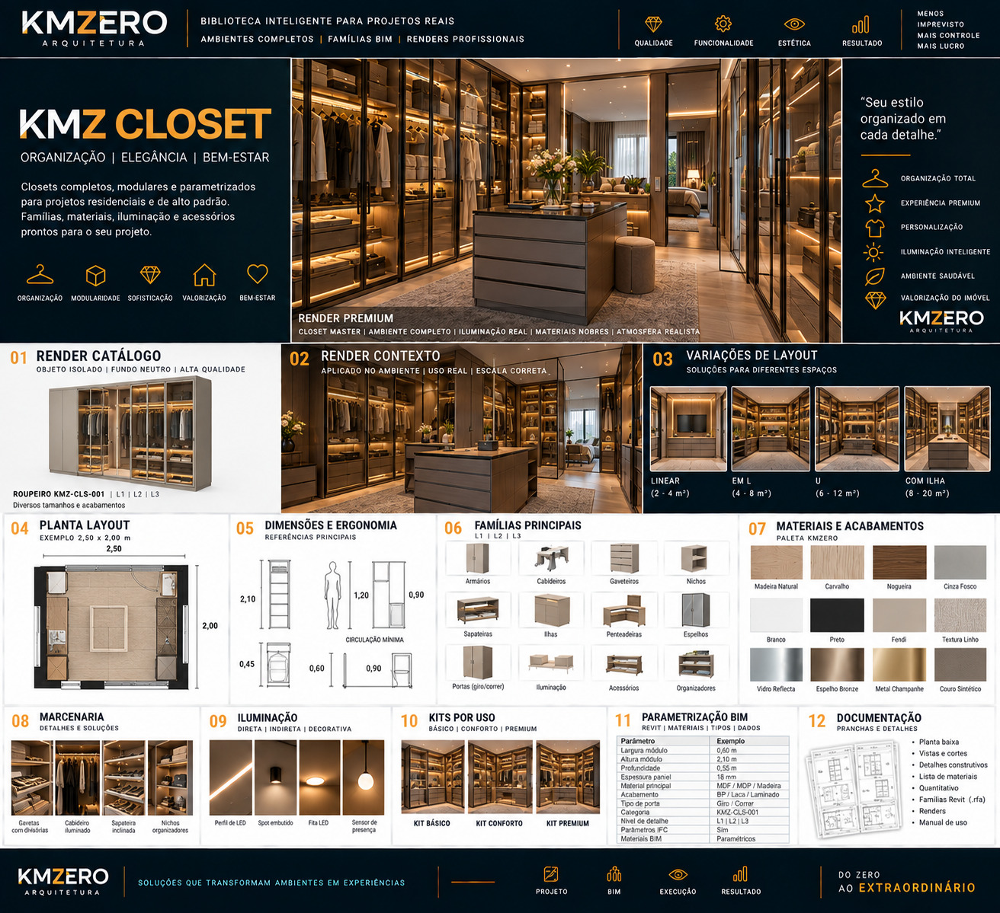

# KMZ CLOSET

Documento: KMZ-ARQ-BIM-001 · Módulo 07 · Ambiente `CLS` · **Rev.00** · `EM DESENVOLVIMENTO`

**Posicionamento:** *Organização | Elegância | Bem-estar*
**Frase-conceito:** *"Seu estilo organizado em cada detalhe."*
**Atributos:** Organização total · Experiência premium · Personalização · Iluminação inteligente · Ambiente saudável · Valorização do imóvel

---

## Referência visual

> **REFERÊNCIA VISUAL APROVADA — CONCEITO**
>
> A linguagem gráfica, composição e direção estética são referências KMZERO.
> Textos, números, CNPJ, registros, dimensões ou outros dados ilustrativos
> eventualmente gerados na imagem **não constituem dados técnicos aprovados**.

---

## 01 · Famílias — `EM DESENVOLVIMENTO`

Armários · Cabideiros · Gaveteiros · Nichos · Sapateiras · Ilhas · Penteadeiras ·
Espelhos · Portas (giro / correr) · Iluminação · Acessórios · Organizadores

Peça-âncora declarada: **Roupeiro `KMZ-CLS-001`**.

**Este é o ambiente mais modular do catálogo** — e por isso o melhor candidato a provar
a regra de "uma família, vários tipos". Um módulo de 0,60 m de largura que se repete e
se combina resolve praticamente o closet inteiro. Se a biblioteca precisar de uma
família por combinação aqui, o modelo de níveis está errado.

## 02 · Níveis L1 / L2 / L3 — `EM DESENVOLVIMENTO`

Declarado `L1 | L2 | L3`. Declara também **"Materiais BIM: Paramétricos"** — ou seja,
material trocável por parâmetro de tipo, não fixo na geometria. Isso é decisão de
modelagem relevante e está coerente com a proposta modular. `A VALIDAR` na implementação.

## 03 · Dimensões — `A VALIDAR` (todas)

| Parâmetro | Valor na referência | Status |
|---|---|---|
| Largura do módulo | 0,60 m | `A VALIDAR` |
| Altura do módulo | 2,10 m | `A VALIDAR` |
| Profundidade | 0,55 m | `A VALIDAR` |
| Espessura do painel | 18 mm | `A VALIDAR` |
| Planta exemplo | 2,50 × 2,00 m | `A VALIDAR` |

Cotas adicionais no bloco de ergonomia (2,10 · 1,20 · 0,90 · 0,45 · 0,60 · 0,90),
com "circulação mínima" indicada — **rótulos não legíveis com segurança na referência**.
Não transcrevo associação rótulo↔valor que não consigo ler. Requer a fonte de origem.

## 04 · Posicionamento — `EM DESENVOLVIMENTO`

Pendente. Regras necessárias: ponto de inserção do módulo (face lateral esquerda
recomendada, para permitir enfileiramento), altura de zócalo, tratamento de canto
(módulo de canto × módulo cego).

**O canto é o problema clássico do closet modular** — precisa de solução definida antes
de modelar, ou toda combinação em L quebra.

## 05 · Ergonomia — `EM DESENVOLVIMENTO`

Alturas de cabideiro (peça longa × peça curta), alcance de prateleira alta, profundidade
útil de sapateira inclinada, circulação entre módulos opostos. **Requer fonte primária.**

## 06 · Materiais — `EM DESENVOLVIMENTO`

| Amostra | Material KMZERO proposto |
|---|---|
| Madeira Natural | `KMZ_MAD_Natural_Acetinado` |
| Carvalho | `KMZ_MAD_Carvalho_Natural` |
| Nogueira | `KMZ_MAD_Nogueira_Natural` |
| Cinza Fosco | `KMZ_PINT_Cinza_Fosco` |
| Branco | `KMZ_PINT_Branco_Fosco` |
| Preto | `KMZ_PINT_Preto_Fosco` |
| Fendi | `KMZ_PINT_Fendi_Fosco` |
| Textura Linho | `KMZ_TEC_Linho_Natural` |
| Vidro Reflecta | `KMZ_VID_Reflecta_Bronze` |
| Espelho Bronze | `KMZ_VID_Espelho-Bronze_Polido` |
| Metal Champanhe | `KMZ_MET_Champagne_Escovado` |
| Couro Sintético | `KMZ_TEC_Couro-Sintetico_Fosco` |

Acabamentos declarados: **BP · Laca · Laminado**. Mapear para `KMZ_Acabamento`.

## 07 · Marcenaria — `EM DESENVOLVIMENTO`

Gavetas com divisórias · cabideiro iluminado · sapateira inclinada · nichos organizadores.

## 08 · Iluminação — `EM DESENVOLVIMENTO`

Perfil de LED · spot embutido · fita LED · **sensor de presença**.

O sensor de presença é o único item de automação declarado em todo o catálogo Rev.00.
Precisa de definição: é família própria, é parâmetro de uma luminária, ou é apenas
especificação de memorial? `A VALIDAR`.

## 09 · Decoração — `EM DESENVOLVIMENTO`

Categoria separada, `KMZ_Quantificar = Não`.

## 10 · Kits — `EM DESENVOLVIMENTO`

BÁSICO · CONFORTO · PREMIUM — composição a definir.

## 11 · BIM / Revit — `EM DESENVOLVIMENTO`

Campo "Categoria" traz `KMZ-CLS-001` → mapeia para `KMZ_Codigo`.
Demais parâmetros: ver [`../09-parametros/`](../09-parametros/).

## 12 · Documentação — `EM DESENVOLVIMENTO`

Planta baixa · vistas e cortes · detalhes construtivos · lista de materiais ·
quantitativo · famílias Revit (`.rfa`) · renders · manual de uso.

## 13 · Renderização — `EM DESENVOLVIMENTO`

| Layout | Área declarada na referência |
|---|---|
| Linear | 2 – 4 m² |
| Em L | 4 – 8 m² |
| Em U | 6 – 12 m² |
| Com ilha | 8 – 20 m² |

Áreas `A VALIDAR`.

---

## Pendências deste ambiente

| # | Pendência | Bloqueia |
|---|---|---|
| CLS-01 | Definir a solução de canto do modular | Etapas 01, 04 |
| CLS-02 | Obter os rótulos corretos do bloco de ergonomia | Etapas 03, 05 |
| CLS-03 | Definir o tratamento do sensor de presença | Etapa 08 |
| CLS-04 | Implementar e testar material paramétrico por tipo | Etapa 02 |
| CLS-05 | Validar todas as cotas de §03 | Uso executivo |
