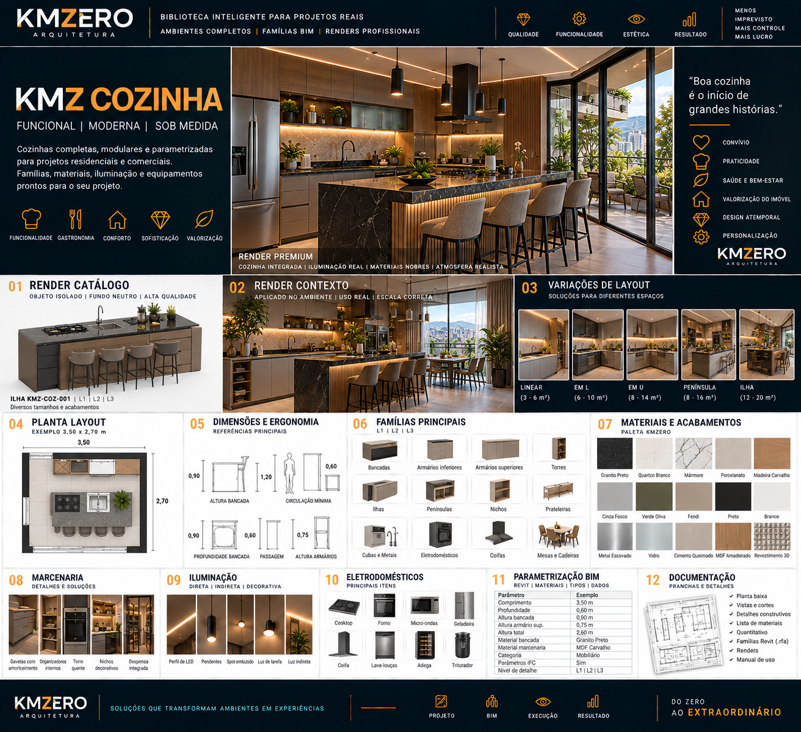

# KMZ COZINHA

Documento: KMZ-ARQ-BIM-001 · Módulo 07 · Ambiente `COZ` · **Rev.00** · `EM DESENVOLVIMENTO`

**Posicionamento:** *Funcional | Moderna | Sob medida*
**Frase-conceito:** *"Boa cozinha é o início de grandes histórias."*
**Atributos:** Convívio · Praticidade · Saúde e bem-estar · Valorização do imóvel · Design atemporal · Personalização

---

## Referência visual

> **REFERÊNCIA VISUAL APROVADA — CONCEITO**
>
> A linguagem gráfica, composição e direção estética são referências KMZERO.
> Textos, números, CNPJ, registros, dimensões ou outros dados ilustrativos
> eventualmente gerados na imagem **não constituem dados técnicos aprovados**.

---

## 01 · Famílias — `EM DESENVOLVIMENTO`

Bancadas · Armários inferiores · Armários superiores · Torres · Ilhas · Penínsulas ·
Nichos · Prateleiras · Cubas e metais · Eletrodomésticos · Coifas · Mesas e cadeiras

Peça-âncora declarada: **Ilha `KMZ-COZ-001`**.

Códigos individuais, categorias Revit e hospedagem: pendentes.

## 02 · Níveis L1 / L2 / L3 — `EM DESENVOLVIMENTO`

Declarado `L1 | L2 | L3`. Definição peça a peça pendente.

## 03 · Dimensões — `A VALIDAR` (todas)

| Parâmetro | Valor na referência | Status |
|---|---|---|
| Comprimento (ilha) | 3,50 m | `A VALIDAR` |
| Profundidade da bancada | 0,60 m | `A VALIDAR` |
| Altura da bancada | 0,90 m | `A VALIDAR` |
| Altura do armário superior | 0,75 m | `A VALIDAR` |
| Altura total | 2,60 m | `A VALIDAR` |
| Planta exemplo | 3,50 × 2,70 m | `A VALIDAR` |

**⛔ Contradição interna na referência:** o bloco de ergonomia apresenta
**"circulação mínima 1,20 m"** e **"passagem 0,60 m"** lado a lado, sem distinguir a que
situação cada uma se aplica; e traz **0,90 m rotulado ora como altura de bancada, ora
como profundidade de bancada**. Não é possível resolver por leitura de imagem.
Circulação em cozinha é dado crítico de projeto — **requer fonte primária**, não
transcrição.

## 04 · Posicionamento — `EM DESENVOLVIMENTO`

Pendente. Pontos que precisam de regra: altura de hospedagem do armário superior,
folga entre bancada e armário superior, recuo de zócalo, posição de ponto elétrico e
hidráulico por módulo.

## 05 · Ergonomia — `EM DESENVOLVIMENTO`

Bloqueado pela contradição de §03. O triângulo de trabalho (geladeira–cocção–lavagem)
ainda não está normatizado neste padrão — **entra como item próprio**, porque é o que
diferencia uma cozinha projetada de uma cozinha desenhada.

## 06 · Materiais — `EM DESENVOLVIMENTO`

| Amostra | Material KMZERO proposto |
|---|---|
| Granito Preto | `KMZ_PED_Granito-Preto_Polido` |
| Quartzo Branco | `KMZ_PED_Quartzo-Branco_Polido` |
| Mármore | `KMZ_PED_Marmore_Polido` |
| Porcelanato | `KMZ_PORC_Neutro_Acetinado` |
| Madeira Carvalho | `KMZ_MAD_Carvalho_Natural` |
| Cinza Fosco | `KMZ_PINT_Cinza_Fosco` |
| Verde Oliva | `KMZ_PINT_Verde-Oliva_Fosco` |
| Fendi | `KMZ_PINT_Fendi_Fosco` |
| Preto | `KMZ_PINT_Preto_Fosco` |
| Branco | `KMZ_PINT_Branco_Fosco` |
| Metal Escovado | `KMZ_MET_Inox_Escovado` |
| Vidro | `KMZ_VID_Incolor_Temperado` |
| Cimento Queimado | `KMZ_CONC_Queimado_Natural` |
| MDF Amadeirado | `KMZ_MAD_MDF-Amadeirado_Fosco` |
| Revestimento 3D | `KMZ_REV_3D_Branco` |

## 07 · Marcenaria — `EM DESENVOLVIMENTO`

Gavetas com amortecimento · organizadores internos · torre quente ·
nichos decorativos · despensa integrada.

Detalhamento de ferragem, corrediça, espessura e folga: pendente.

## 08 · Iluminação — `EM DESENVOLVIMENTO`

Perfil de LED · pendentes · spot embutido · luz de tarefa · luz indireta.

**Nota técnica:** cozinha exige luz de tarefa sobre bancada com boa reprodução de cor —
é requisito funcional, não estético. Valores-alvo de iluminância e IRC: pendentes,
requerem fonte primária.

## 09 · Decoração — `EM DESENVOLVIMENTO`

Categoria separada, `KMZ_Quantificar = Não`.

## 10 · Eletrodomésticos — `EM DESENVOLVIMENTO`

Cooktop · forno · micro-ondas · geladeira · coifa · lava-louças · adega · triturador.

**Observação sobre a matriz:** neste ambiente o bloco 10 da prancha é
**Eletrodomésticos**, não **Kits por uso**. A posição na composição é fixa, o conteúdo
se adapta — comportamento previsto em [`_MATRIZ-OFICIAL.md`](./_MATRIZ-OFICIAL.md).
Os kits Básico/Conforto/Premium continuam valendo e precisam ser definidos à parte.

**Decisão necessária:** eletrodoméstico entra na biblioteca KMZERO como família própria
ou como família de fabricante? Modelar todos internamente é custo alto e desatualiza
rápido; usar família de fabricante compromete a padronização de parâmetros. Recomendo
**família KMZERO genérica por tipo** (volume correto + parâmetros KMZERO), trocável por
família de fabricante só no render PREMIUM. `A VALIDAR`.

## 11 · BIM / Revit — `EM DESENVOLVIMENTO`

**⚠️ Inconsistência entre referências:** neste ambiente o campo "Categoria" traz
**"Mobiliário"** (categoria Revit), enquanto no Banheiro, Closet e Gourmet o mesmo campo
traz o **código KMZ** (`KMZ-BAN-001` etc.). São dois conceitos distintos ocupando o
mesmo campo. Resolvido no padrão pela separação em dois parâmetros:
`KMZ_Codigo` (código da linha) e a categoria nativa do Revit.

Mapeamento: ver [`../09-parametros/`](../09-parametros/).

## 12 · Documentação — `EM DESENVOLVIMENTO`

Planta baixa · vistas e cortes · detalhes construtivos · lista de materiais ·
quantitativo · famílias Revit (`.rfa`) · renders · manual de uso.

## 13 · Renderização — `EM DESENVOLVIMENTO`

| Layout | Área declarada na referência |
|---|---|
| Linear | 3 – 6 m² |
| Em L | 6 – 10 m² |
| Em U | 8 – 14 m² |
| Península | 8 – 16 m² |
| Ilha | 12 – 20 m² |

Áreas `A VALIDAR`.

---

## Pendências deste ambiente

| # | Pendência | Bloqueia |
|---|---|---|
| COZ-01 | Resolver circulação mínima × passagem (fonte primária) | Etapas 03, 05 |
| COZ-02 | Normatizar o triângulo de trabalho | Etapa 05 |
| COZ-03 | Decidir estratégia de eletrodomésticos | Etapas 01, 10 |
| COZ-04 | Definir iluminância e IRC de bancada | Etapa 08 |
| COZ-05 | Validar todas as cotas de §03 | Uso executivo |
