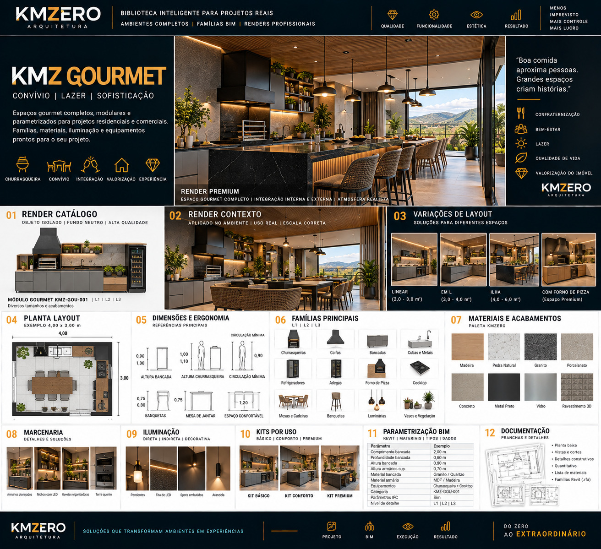

# KMZ GOURMET

Documento: KMZ-ARQ-BIM-001 · Módulo 07 · Ambiente `GOU` · **Rev.00** · `EM DESENVOLVIMENTO`

**Posicionamento:** *Convívio | Lazer | Sofisticação*
**Frase-conceito:** *"Boa comida aproxima pessoas. Grandes espaços criam histórias."*
**Atributos:** Confraternização · Bem-estar · Lazer · Qualidade de vida · Experiência

---

## Referência visual

> **REFERÊNCIA VISUAL APROVADA — CONCEITO**
>
> A linguagem gráfica, composição e direção estética são referências KMZERO.
> Textos, números, CNPJ, registros, dimensões ou outros dados ilustrativos
> eventualmente gerados na imagem **não constituem dados técnicos aprovados**.

---

## 01 · Famílias — `EM DESENVOLVIMENTO`

Churrasqueiras · Coifas · Bancadas · Cubas e metais · Refrigeradores · Adegas ·
Forno de pizza · Cooktop · Mesas e cadeiras · Banquetas · Luminárias · Vasos e vegetação

Peça-âncora declarada: **Módulo Gourmet `KMZ-GOU-001`**.

**⚠️ Este é o único ambiente do catálogo com equipamento de combustão.** Churrasqueira e
forno de pizza envolvem exaustão, afastamento de material combustível e, dependendo do
caso, projeto específico de chaminé. Isso tem consequência direta na família: ela precisa
carregar, no mínimo, o volume de exaustão e a zona de afastamento como geometria —
senão o modelo "cabe" em lugares onde a obra não cabe.

**Requer fonte primária** (norma de instalação e código de obras local) antes de fixar
qualquer afastamento. Não vou propor números aqui.

## 02 · Níveis L1 / L2 / L3 — `EM DESENVOLVIMENTO`

Declarado `L1 | L2 | L3`. Definição peça a peça pendente.

## 03 · Dimensões — `A VALIDAR` (todas)

| Parâmetro | Valor na referência | Status |
|---|---|---|
| Comprimento da bancada | 2,00 m | `A VALIDAR` |
| Profundidade da bancada | 0,60 m | `A VALIDAR` |
| Altura da bancada | 0,90 m | `A VALIDAR` |
| Altura dos armários superiores | 0,70 m | `A VALIDAR` |
| Planta exemplo | 4,00 × 3,00 m | `A VALIDAR` |

Bloco de ergonomia da referência traz faixas em vez de valores únicos —
altura de bancada 0,90/1,00 · altura de churrasqueira 1,00/1,10 · banquetas 0,75/0,80 ·
mesa de jantar 0,75 · circulação mínima 0,90 · espaço confortável 1,20.

**Observação:** faixa em vez de valor único é, aqui, provavelmente **intencional e
correta** — altura de churrasqueira varia com o modelo e com a altura do usuário. Ainda
assim, para virar parâmetro Revit é preciso um valor padrão + faixa admissível.
`A VALIDAR`.

## 04 · Posicionamento — `EM DESENVOLVIMENTO`

Pendente. Crítico: posição da churrasqueira em relação à área de circulação e à mesa,
altura e recuo da coifa, afastamento de armário em relação à fonte de calor.

## 05 · Ergonomia — `EM DESENVOLVIMENTO`

Além das cotas de §03: altura de banqueta em relação a bancada alta (a diferença
banqueta↔bancada é o que define conforto, não a altura isolada de cada uma), e espaço
por pessoa na bancada. Requer definição.

## 06 · Materiais — `EM DESENVOLVIMENTO`

| Amostra | Material KMZERO proposto |
|---|---|
| Madeira | `KMZ_MAD_Natural_Acetinado` |
| Pedra Natural | `KMZ_PED_Natural_Bruto` |
| Granito | `KMZ_PED_Granito-Preto_Polido` |
| Porcelanato | `KMZ_PORC_Neutro_Acetinado` |
| Concreto | `KMZ_CONC_Aparente_Natural` |
| Metal Preto | `KMZ_MET_Pintado_Preto-Fosco` |
| Vidro | `KMZ_VID_Incolor_Temperado` |
| Revestimento 3D | `KMZ_REV_3D_Branco` |

**Pendência específica:** área gourmet é frequentemente semiaberta. Os materiais
precisam de uma marcação de **uso interno × externo** (resistência a intempérie), que
não existe na paleta atual. Sem isso, a biblioteca vai especificar acabamento interno em
varanda aberta. `A VALIDAR`.

## 07 · Marcenaria — `EM DESENVOLVIMENTO`

Armários ripados · nichos com LED · gavetas organizadas · torre quente.

## 08 · Iluminação — `EM DESENVOLVIMENTO`

Pendentes · fita de LED · spots embutidos · arandela.

## 09 · Decoração — `EM DESENVOLVIMENTO`

Vasos e vegetação. Categoria separada, `KMZ_Quantificar = Não`.

## 10 · Kits — `EM DESENVOLVIMENTO`

BÁSICO · CONFORTO · PREMIUM — composição a definir.
Equipamentos declarados no padrão: **churrasqueira + cooktop**.

## 11 · BIM / Revit — `EM DESENVOLVIMENTO`

Campo "Categoria" traz `KMZ-GOU-001` → mapeia para `KMZ_Codigo`.
Demais parâmetros: ver [`../09-parametros/`](../09-parametros/).

## 12 · Documentação — `EM DESENVOLVIMENTO`

A referência deste ambiente lista **menos itens** que os demais: planta baixa ·
vistas e cortes · quantitativo · lista de materiais · famílias Revit (`.rfa`).
Faltam detalhes construtivos, renders e manual de uso.

**Tratado como omissão da referência, não como escopo reduzido.** O padrão de
documentação é o mesmo para todos os ambientes. Se houver motivo para reduzir aqui,
precisa ser decisão registrada — não silêncio.

## 13 · Renderização — `EM DESENVOLVIMENTO`

| Layout | Área declarada na referência |
|---|---|
| Linear | 2,0 – 3,0 m² |
| Em L | 3,0 – 4,0 m² |
| Ilha | 4,0 – 6,0 m² |
| Com forno de pizza | "Espaço premium" (sem área declarada) |

Áreas `A VALIDAR`. **Nota:** as áreas declaradas aqui são sensivelmente menores que as
da Cozinha (3–20 m²) para tipologias equivalentes. Provavelmente se referem à **área do
módulo**, não à área do ambiente — ao contrário dos outros ambientes, onde a leitura é
de área de ambiente. Precisa ser esclarecido, senão a comparação entre ambientes engana.

---

## Pendências deste ambiente

| # | Pendência | Bloqueia |
|---|---|---|
| GOU-01 | Consultar norma de instalação de churrasqueira/exaustão (fonte primária) | Etapas 01, 04 |
| GOU-02 | Definir valor padrão + faixa admissível para as cotas em faixa | Etapa 03 |
| GOU-03 | Criar marcação de uso interno × externo nos materiais | Etapa 06 |
| GOU-04 | Esclarecer se as áreas de layout são do módulo ou do ambiente | Etapa 13 |
| GOU-05 | Confirmar o escopo de documentação (omissão × redução) | Etapa 12 |
| GOU-06 | Validar todas as cotas de §03 | Uso executivo |
