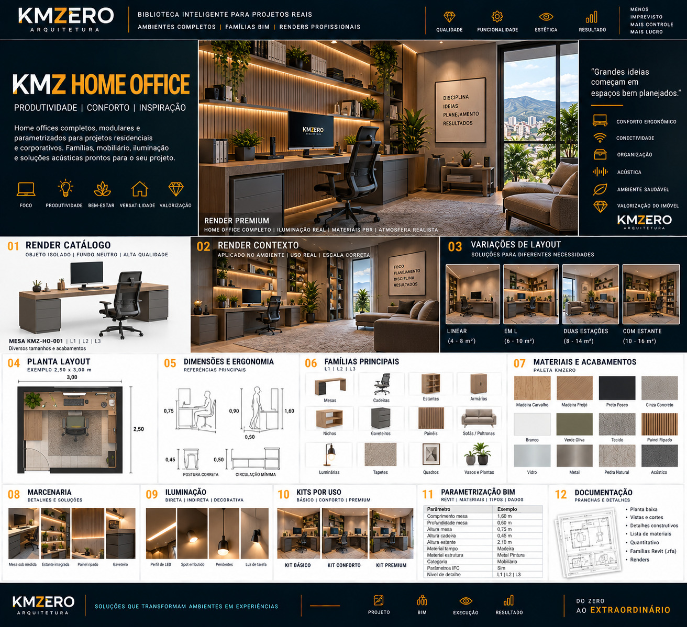

# KMZ HOME OFFICE

Documento: KMZ-ARQ-BIM-001 · Módulo 07 · Ambiente `HOF` · **Rev.00** · `EM DESENVOLVIMENTO`

**Posicionamento:** *Produtividade | Conforto | Inspiração*
**Frase-conceito:** *"Grandes ideias começam em espaços bem planejados."*
**Atributos:** Conforto ergonômico · Conectividade · Organização · Acústica · Ambiente saudável · Valorização do imóvel

---

## Referência visual

> **REFERÊNCIA VISUAL APROVADA — CONCEITO**
>
> A linguagem gráfica, composição e direção estética são referências KMZERO.
> Textos, números, CNPJ, registros, dimensões ou outros dados ilustrativos
> eventualmente gerados na imagem **não constituem dados técnicos aprovados**.

---

## 01 · Famílias — `EM DESENVOLVIMENTO`

Mesas · Cadeiras · Estantes · Armários · Nichos · Gaveteiros · Painéis ·
Sofás e poltronas · Luminárias · Tapetes · Quadros · Vasos e plantas

Peça-âncora declarada: **Mesa `KMZ-HO-001`**.

**⚠️ Divergência de código:** a referência usa `KMZ-HO-001` (duas letras), enquanto os
demais ambientes usam três (`BAN`, `COZ`, `CLS`, `GOU`). O padrão adota **três letras
para todos** — este ambiente é `HOF`, logo `KMZ-HOF-001`. Ver
[`../08-nomenclatura-bim.md`](../08-nomenclatura-bim.md) §8.2.

**Atenção à etapa 09:** quatro dos doze itens listados (tapetes, quadros, vasos e
plantas, e parte dos sofás) são **decoração**, não projeto. Precisam ir para categoria
separada com `KMZ_Quantificar = Não`, ou o quantitativo do ambiente sai inflado.

## 02 · Níveis L1 / L2 / L3 — `EM DESENVOLVIMENTO`

Declarado `L1 | L2 | L3`. Definição peça a peça pendente.

## 03 · Dimensões — `A VALIDAR` (todas)

| Parâmetro | Valor na referência | Status |
|---|---|---|
| Comprimento da mesa | 1,60 m | `A VALIDAR` |
| Profundidade da mesa | 0,60 m | `A VALIDAR` |
| Altura da mesa | 0,75 m | `A VALIDAR` |
| Altura da cadeira | 0,45 m | `A VALIDAR` |
| Altura da estante | 2,10 m | `A VALIDAR` |
| Planta exemplo | 2,50 × 3,00 m | `A VALIDAR` |

Bloco de ergonomia indica **"postura correta"** e **"circulação mínima"** com valores
0,75 · 0,90 · 1,60 · 0,50 · 0,45 · 0,50. A associação rótulo↔valor não é legível com
segurança na referência e **não será transcrita por suposição**.

## 04 · Posicionamento — `EM DESENVOLVIMENTO`

Pendente. Pontos críticos: distância da mesa à parede para passagem da cadeira,
posição do ponto elétrico e de rede em relação ao tampo, altura de painel ripado.

## 05 · Ergonomia — `EM DESENVOLVIMENTO`

**Este é o ambiente onde ergonomia deixa de ser conforto e vira requisito.** Altura de
tampo, altura de assento, distância olho-monitor e ângulo de visão têm normatização
ocupacional própria. **Requer fonte primária** — não vou citar valores de memória para
um ambiente de trabalho.

## 06 · Materiais — `EM DESENVOLVIMENTO`

| Amostra | Material KMZERO proposto |
|---|---|
| Madeira Carvalho | `KMZ_MAD_Carvalho_Natural` |
| Madeira Freijó | `KMZ_MAD_Freijo_Natural` |
| Preto Fosco | `KMZ_PINT_Preto_Fosco` |
| Cinza Concreto | `KMZ_CONC_Cinza_Natural` |
| Branco | `KMZ_PINT_Branco_Fosco` |
| Verde Oliva | `KMZ_PINT_Verde-Oliva_Fosco` |
| Tecido | `KMZ_TEC_Generico_Natural` |
| Painel Ripado | `KMZ_REV_Ripado_Madeira` |
| Vidro | `KMZ_VID_Incolor_Temperado` |
| Metal | `KMZ_MET_Pintado_Fosco` |
| Pedra Natural | `KMZ_PED_Natural_Bruto` |
| **Acústico** | `KMZ_REV_Acustico_Feltro` |

O material acústico é o único da paleta com **função de desempenho**, não de aparência.
Precisa de propriedade física associada no Revit se for entrar em memorial de acústica.
`A VALIDAR`.

## 07 · Marcenaria — `EM DESENVOLVIMENTO`

Mesa sob medida · estante integrada · painel ripado · gaveteiro.

## 08 · Iluminação — `EM DESENVOLVIMENTO`

Perfil de LED · spot embutido · pendentes · luz de tarefa.

Luz de tarefa sobre plano de trabalho é requisito funcional. Valores-alvo: pendentes.

## 09 · Decoração — `EM DESENVOLVIMENTO`

Tapetes · quadros · vasos e plantas. Categoria separada, `KMZ_Quantificar = Não`.

## 10 · Kits — `EM DESENVOLVIMENTO`

BÁSICO · CONFORTO · PREMIUM — composição a definir.

## 11 · BIM / Revit — `EM DESENVOLVIMENTO`

Campo "Categoria" traz **"Mobiliário"** (categoria Revit), não o código KMZ — mesma
inconsistência observada na Cozinha. Resolvida pela separação entre `KMZ_Codigo` e a
categoria nativa. Ver [`../09-parametros/`](../09-parametros/).

## 12 · Documentação — `EM DESENVOLVIMENTO`

Planta baixa · vistas e cortes · detalhes construtivos · lista de materiais ·
quantitativo · famílias Revit (`.rfa`) · renders.

## 13 · Renderização — `EM DESENVOLVIMENTO`

| Layout | Área declarada na referência |
|---|---|
| Linear | 4 – 8 m² |
| Em L | 6 – 10 m² |
| Duas estações | 8 – 14 m² |
| Com estante | 10 – 16 m² |

Áreas `A VALIDAR`.

---

## Pendências deste ambiente

| # | Pendência | Bloqueia |
|---|---|---|
| HOF-01 | Corrigir o código de `HO` para `HOF` em todo material futuro | Nomenclatura |
| HOF-02 | Consultar normatização ergonômica ocupacional (fonte primária) | Etapa 05 |
| HOF-03 | Separar decoração de projeto na lista de famílias | Etapas 01, 09 |
| HOF-04 | Definir propriedade física do material acústico | Etapa 06 |
| HOF-05 | Validar todas as cotas de §03 | Uso executivo |
